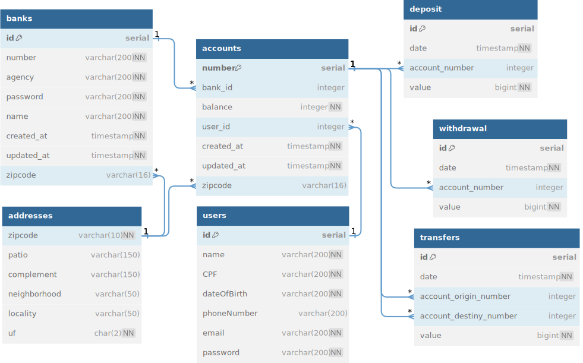
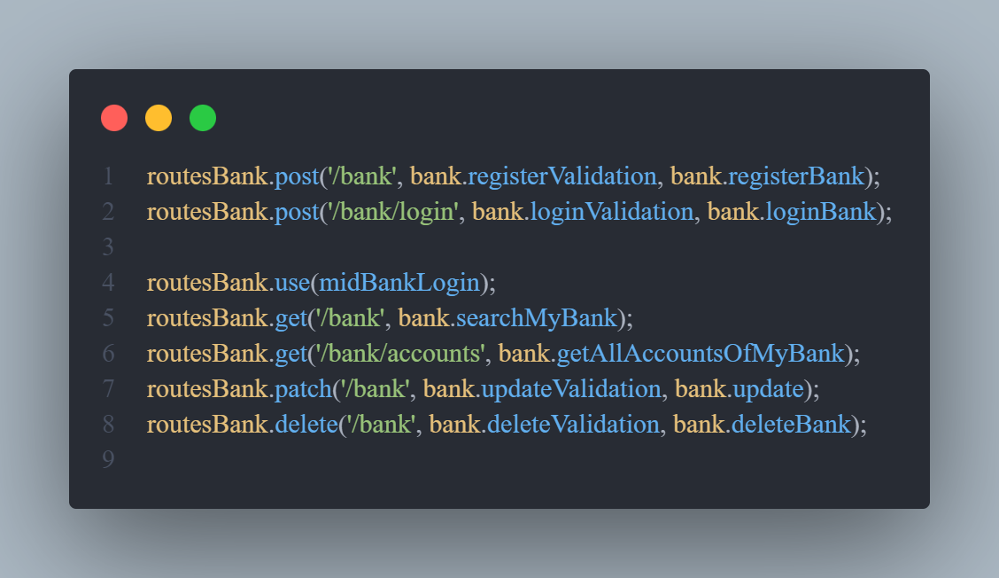

### A razão dessa API surgiu por conta de um desafio que fiz no modulo 2 do meu curso na Cubos Academy, lá utilizamos somente Nodejs e arquivos Json simulando o banco de dados, para a manipulação dos dados de um usuário especifico, simulando ações em uma conta só

### Optei por pegar essa idéia e transformar em um banco de verdade, aqui é possível ter o cadastro de vários bancos, e ter contas em diferentes bancos, todos os dados são separados por entidades no PostgreSQL, existe uma para o banco em si, para as contas, para os dados de cada usuário, de transações, depósitos e saques também, e ainda possui uma de endereços, aqui vai um diagrama do projeto no banco de dados:



### Escolhi esse formato para permitir que existam vários bancos, cada banco possui várias contas e cada conta possui um usuário, eu separo os dados pessoas do usuário em outra tabela, mas as duas em si representam o usuário, a tabela de accounts é usada para os dados mais técnicos da conta criada, e a de users para guardar cpf, email, etc..

### Todo banco e toda conta de usuário possui um endereço próprio, que eu busco pelo CEP informado no body da requisição, usando a API ViaCEP, as tabelas de transações conversam com a accounts por meio do número dela

---

## Essa API é feita principalmente com as seguintes tecnlogias:


### Como menção honrosa também tem o [yup](https://www.npmjs.com/package/yup) que eu uso para validar campos, também o [bcrypt](https://www.npmjs.com/package/bcrypt) para criptografar dados

### Até o momento tenho prontas as rotas do banco em si, logo mais farei as de contas/usuários e das operações bancárias



### Para rodar o programa é preciso que crie um arquivo ".env" com as variaveis de ambiente, eu criei um arquivo ".env.example" com o nome das váriaveis, só é necessário colocar os dados do seu banco e das senhas que o JWT irá usar para autenticação e portas do servidor, após configurar isso coloque os seguintes comandos no seu terminal:

```
npm install

npm start
```

## Para saber o que deve ser enviado no corpo de algumas requisições, basta tentar, o sistema de validação do yup vai te enviar uma mensagem informando os campos necessários
